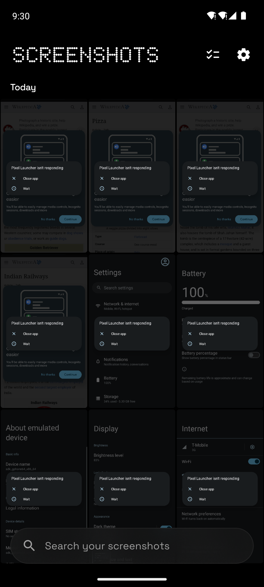
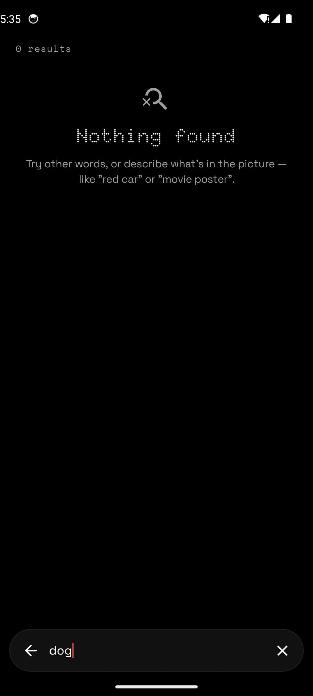
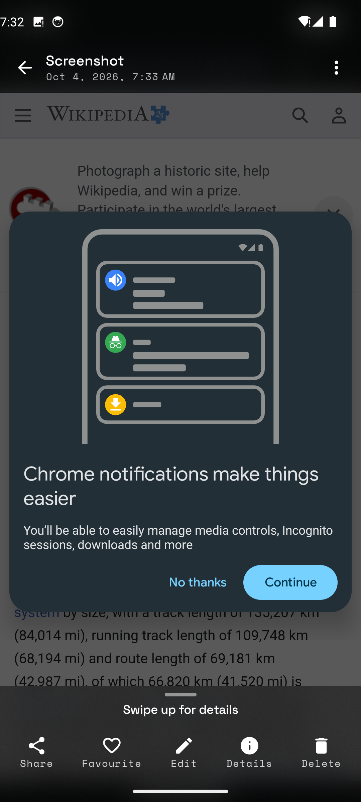
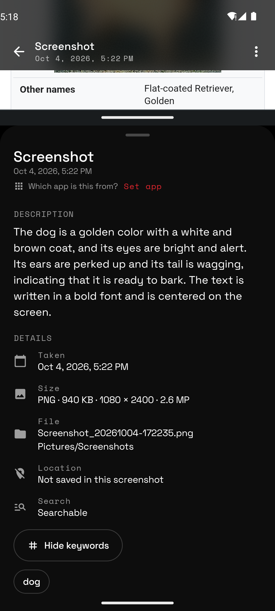
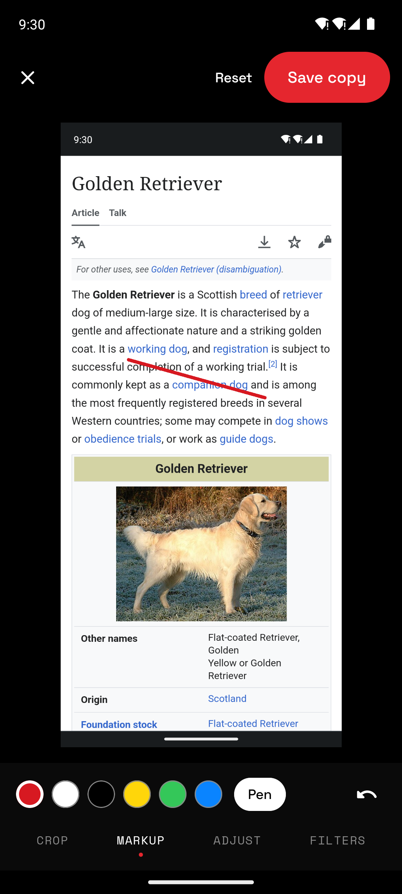
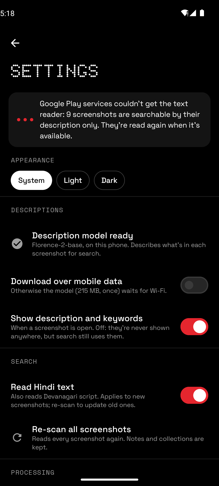

# Dot Screenshots

Find any screenshot by what's in it. Dot Screenshots reads the text in your screenshots, describes
what's in their pictures and lists the objects it sees, entirely on your phone: no account, nothing
uploaded. The APK is about 15 MB; the description model (215 MB) downloads once after install.

<p align="center">
  
  
  
  
</p>
<p align="center">
  
  
</p>

## Features

- **Descriptions**: every screenshot gets one, like "a woman sitting on a couch wearing a black top and blue jeans, with a pair of black boots", plus the objects in it (Florence-2, downloaded after install, on Wi-Fi unless you allow mobile data).
- **Search by words or pictures**: "upi payment", "train ticket", "black boots". Matches in keywords, the app, your notes and the description come first; matches only in the screen's text are behind *Show more*. Every result contains your words.
- **Knows the app**: names the app from the words its own screen shows (WhatsApp, Instagram, Reddit, GitHub…).
- **Details**: date and time, size, resolution, folder, location (when recorded) and the screen's text on request. Descriptions and keywords are used for search; Settings can show them too.
- **Edit**: crop, rotate, straighten, markup, adjust and filters; saved as a copy next to the original.
- **Collections, favourites, notes** (notes are searchable too) and quick actions for links, numbers and codes.
- **Works in the background**: new screenshots are read right away, older ones on battery above 20 % or while charging (you choose in Settings), with the app closed too.

## Download

Get `DotScreenshots.apk` from the [latest release](https://github.com/pdrajan0x/Screenshot/releases/latest),
open it on your phone and install. Android 8.0 or newer, 64-bit ARM.

## Build the APK

You need JDK 21 and the Android SDK (`ANDROID_HOME` set).

```bash
git clone https://github.com/pdrajan0x/Screenshot.git && cd Screenshot
./gradlew :app-screenshots:assembleRelease
```

The APK is in `app-screenshots/build/outputs/apk/release/`. No models are needed to build: the app
downloads Florence-2-base from Hugging Face after install and checks each file against the sizes and
SHA-256 sums in `core/ml/src/main/assets/florence/florence_config.json`. To update that config or run
the Kotlin-vs-Python parity test (Python 3.12):

```bash
pip install -r tools/model/requirements.txt
python tools/model/fetch_florence.py --out model-out   # model-out/ is only for the test
./gradlew :core:engine:test
```
 Without your own signing key
(`DOT_SIGNING_STORE` and `DOT_SIGNING_PASSWORD`) it is signed with the debug key.
Every push to the default branch is also built by GitHub Actions and published as the latest release.

## How it works

| Part | What it does |
| --- | --- |
| Google ML Kit text recognition (through Play services) | Reads the text on screen (Latin, optionally Devanagari) |
| Florence-2-base on ONNX Runtime | Describes each screenshot and finds the objects in it |
| SQLite FTS4 | Fast, precise word search |
| Jetpack Compose | Nothing-inspired UI in black, white and red |

Code layout: `app-screenshots` (the app), `core/engine` (search, keywords, app names; plain Kotlin with tests),
`core/ml` (OCR and Florence-2), `core/media` (MediaStore, battery rules), `core/design` (theme and components),
`tools/model` (Florence-2 config and parity fixtures).

## Licenses

Florence-2 and ONNX Runtime: MIT. Fonts (Doto, Space Grotesk, Space Mono): SIL OFL 1.1. Coil, Telephoto, Haze, AndroidX: Apache 2.0.
